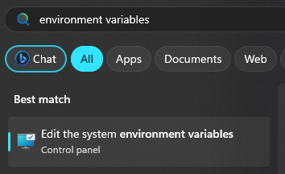
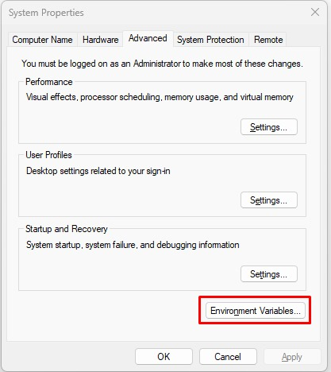
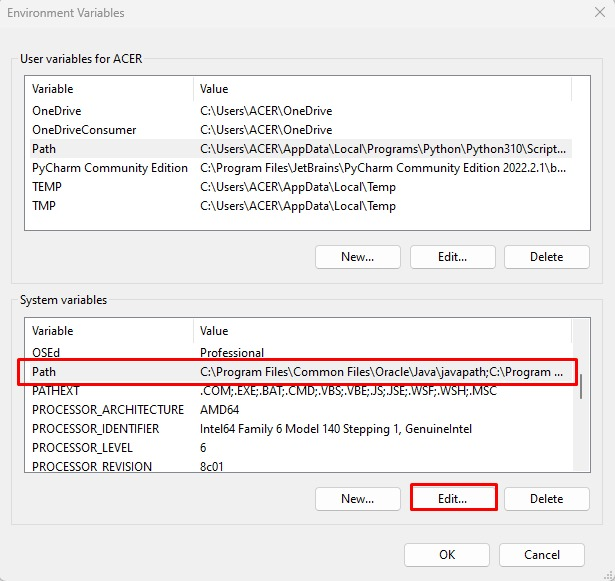
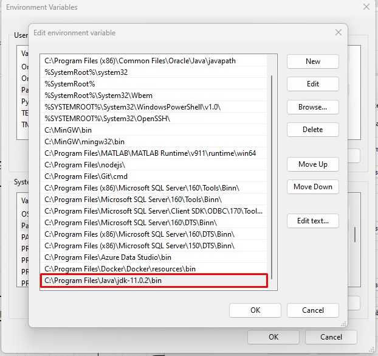
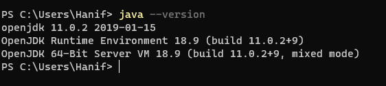

# Tutorial Instalasi Java

## Unduh Java JDK
- Unduh versi 17 dan sesuaikan dengan sistem operasi yang digunakan. 
Unduh di tautan [berikut](https://www.oracle.com/java/technologies/downloads/)
- Lakukan proses instalasi sampai selesai.

## Tambah Lingkungan Variabel
Setelah proses instalasi selesai, tambahkan *path* bin dari folder Java ke dalam lingkungan variabel.
### Untuk Windows
1. Buka lokasi tempat folder Java disimpan, kemudian masuk ke dalam folder bin dan salin *path*-nya. Biasanya akan berbentuk seperti berikut
`C:\Program Files\Java\jdk-11.0.2\bin`
2. Buka pencarian pada Windows (tombol Win) lalu ketikan *Environment Variable* lalu pilih "*Edit the system environment variables*"

3. Pilih tombol "*Environment Variables...*"

4. Pilih "*Path*" pada "*System variables*" dan pilih "*Edit...*"

5. Pilih "*New*" dan tempelkan *path* dari bin Java yang sudah disalin sebelumnya

6. Klik "*Oke*" dan *restart* (opsional) perangkat komputer Anda (biasanya, sistem operasi Windows ini harus di-*restart* terlebih dahulu untuk membuatnya dapat diterapkan)

### Untuk macOS
Silahkan cari sendiri tutorialnya, saya tidak punya macOS (asisten praktikum yang ini tidak punya modal).

### Untuk Linux
1. Buka terminal, ketikkan `java_path=$(which java)`
2. Ketikkan `echo 'export JAVA_HOME=$java_path' >> $HOME/.bash` jika menggunakan bash. Untuk selainnya, maka sesuaikan ajah saya tau kalian jago kalo udah memutuskan untuk mengganti terminal.

## Periksa versi Java
Untuk memeriksa versi Java, buka terminal lalu ketikkan `java --version`. Jika sudah muncul seperti gambar di bawah, maka Java siap digunakan.

---
 

    
   
  

    Dibuat dengan 🫶 oleh asisten praktikum ADS
  

