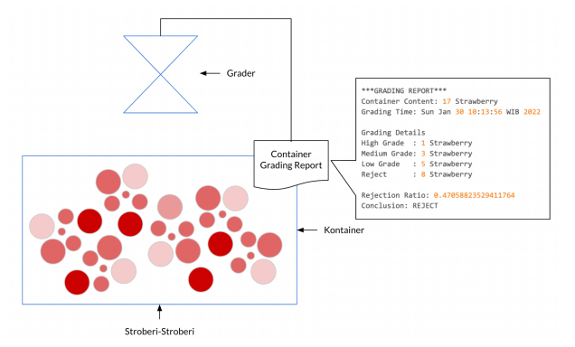
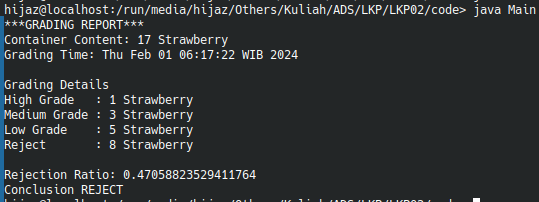

# Lembar Kerja 2

## Deskripsi Soal
Sebuah pabrik selai membuat selai stroberi. Setiap harinya, mereka akan menerima satu kontainer buah stroberi dari perkebunan stroberi rekanan mereka. Akan tetapi, kualitas (*grade*) stroberi yang ada pada kontainer tersebut bermacam-macam.



Kualitas daripada stroberi dilihat dari berat (*weight*) dan warnanya (*color*) dengan standar sebagai berikut:

| Grade | Weight | Color |
| :---: | :---: | :---: |
| High | >18 gram | Dark Red or Medium Red |
| Medium | 12 gram > weight >= 18 gram | Dark Red or Medium Red |
| Low | 7 gram > weight >= 12 gram | Dark Red
| Reject | Others |

Pabrik hanya akan menerima kontainer stroberi apabila jumlah kualitas *reject* paling banyak 30% dari jumlah seluruh stroberi di kontainer tersebut. Oleh karena itu, mereka membuat suatu mesin yang disebut sebagai *grader*. Grader akan menganalisis isi dari kontainer dan menentukan kualitas stroberi, sekaligus mencatat jumlah stroberi per kualitas dalam sebuah laporan. Berdasarkan hasil tersebut, *grader* akan memutuskan apakah pabrik dapat menerima atau menolak kontainer tersebut. Apabila kontainer diterima, kontainer tersebut akan diteruskan ke proses selanjutnya. Kontainer yang ditolak akan dikembalikan ke perkebunan stroberi.

Tugas kalian adalah mensimulasikan kegiatan di atas dalam suatu proyek sederhana yang dibuat dengan paradigma berorientasi objek.

### Contoh Masukan
```
18 DARK_RED
1 DARK_RED
10 MEDIUM_RED
12 LIGHT_RED
14 DARK_RED
18 MEDIUM_RED
11 DARK_RED
10 DARK_RED
2 DARK_RED
3 DARK_RED
40 LIGHT_RED
20 DARK_RED
2 DARK_RED
7 MEDIUM_RED
12 DARK_RED
12 DARK_RED
9 DARK_RED
```

### Contoh Keluaran
```
***GRADING REPORT***
Container Content: 17 Strawberry
Grading Time: Thu Feb 01 06:17:22 WIB 2024

Grading Details
High Grade   : 1 Strawberry
Medium Grade : 3 Strawberry
Low Grade    : 5 Strawberry
Reject       : 8 Strawberry

Rejection Ratio: 0.47058823529411764
Conclusion REJECT
```

---
<br>

# Format Pengerjaan
- **Cuplikan Program**: sertakan setidaknya satu buah cuplikasi program yang telah dijalankan. Apabila program yang dibuat memiliki unsur animasi, sertakan pula tautan hasil ekspor berupa rekaman atau GIF ke Google Drive yang dapat diakses oleh publik.
- **Kode Program**: sertakan kode program yang dibuat. Untuk memformat kode, pasang *Add-Ons* [Code Blocks](https://workspace.google.com/marketplace/app/code_blocks/100740430168) pada Google Docs. Gunakan pengaturan `Language = javascript` dan `Theme = tomorrow`. Setelah itu, berikan nomor baris pada kodenya. Ubah ukuran huruf menjadi 10 poin. Kalian dapat melakukan perubahan format (atau meletakkan kode program dengan cara lain) asalkan kode program dapat terbaca dengan nyaman dan diberi nomor baris. Berikan komentar pada kode untuk menandai fungsi dari suatu blok program.
- **Ulasan Kode Program**: jelaskan kode program yang telah dibuat. Penjelasan tidak perlu sangat detail (per baris). Prioritaskan penjelasan kode program yang sulit untuk dipahami.

## Contoh
**A. Cuplikan Keluaran Program**




**B. Kode Program**

Driver.java
```
1. public class Bicycle {
2.      // the Bicycle class has
3.      // three fields
4.      public int cadence;
5.      public int gear;
6.      public int speed;
7.
8.      // the Bicycle class has
9.      // one constructor
10.     public Bicycle(int startCadence, int startSpeed, int startGear) {
11.         gear = startGear;
12.         cadence = startCadence;
13.         speed = startSpeed;
14.     }
15.
16.     // the Bicycle class has
17.     // four methods
18.     public void setCadence(int newValue) {
19.         cadence = newValue;
20.     }
21.
22.     public void setGear(int newValue) {
23.         gear = newValue;
24. }
25.
26.     public void applyBrake(int decrement) {
27.         speed -= decrement;
28. }
29.
30.     public void speedUp(int increment) {
31.         speed += increment;
32.     }
33. }
```

MountainBike.java
```
1. public class MountainBike extends Bicycle {
2.
3.      // the MountainBike subclass has
4.      // one field
5.      public int seatHeight;
6.
7.      // the MountainBike subclass has
8.      // one constructor
9.      public MountainBike(int startHeight, int startCadence,
10.                         int startSpeed, int startGear) {
11.         super(startCadence, startSpeed, startGear);
12.         seatHeight = startHeight;
13.     }
14.
15.     // the MountainBike subclass has
16.     // one method
17.     public void setHeight(int newValue) {
18.         seatHeight = newValue;
19.     }
20. }
```

**C. Ulasan**

Berdasarkan kode program yang telah kalian buat, identifikasilah konsep *Object Oriented* yang kalian gunakan. Deskripsi bisa berupa nama kelas dan baris tempat konsep tersebut digunakan, atau penjelasan naratif (apabila konsep tersebut sulit dijelaskan dengan nama kelas dan baris).

| No | Konsep *Object Oriented* | Digunakan? | Deskripsi |
| --- | --- | --- | --- |
| 1 | *Class* | Ya | *Class* MountainBike digunakan sebagai objek dari Bicycle yang merepresentasikan ...
| 2 | *Object* | ... | ... | ... |
| 3 | *Inheritance* | ... | ... |
| 4 | *Polymorphism* | ... | ... |
| 5 | *Abstraction* | ... | ... |
| 6 | *Encapsulation* | ... | ... |
| 7 | *Composition* | ... | ... |


<br>

---

<br>

# Petunjuk/*Clue*
<ol>
  <li>
    Jika bingung membuat solusi dari masalah dalam bentuk kode, buat <i>flow chart</i> atau <i>pseudocode</i> terlebih dahulu, atau buat terlebih dahulu dengan gaya <i>functional programming</i>
  </li>
  <li>
    Buatlah masing-masing satu fail yang merepresentasikan satu objek atau kelas, sehingga fail yang dibutuhkan adalah
    <ul>
      <li>Strawberry.java sebagai representasi objek stroberi</li>
      <li>Container.java sebagai representasi kontainer yang mewadahi stroberi</li>
      <li>Grader.java sebagai representasi alat untuk menentukan <i>grade</i> dari stroberi yang dibawa oleh kontainer</li>
      <li>Main.java/Driver.java, program untuk mengatur apakah stroberi ditambahkan atau berhenti ditambahkan ke kontainer</li>
    </ul>
  </li>
  <li>
    Gunakan Main.java/Driver.java hanya untuk menjalankan program, jadi tidak ada objek atau kelas lain di dalamnya. Gunakan objek dengan fungsi File() untuk membaca masukan dalam bentuk teks, objek atau modul tersebut bisa digunakan dari <code>java.io.File</code>. Jangan lupa menambahkan pengecualian jika fail yang dibaca tidak ada (<code>FileNotFoundException</code>).
    <br>
    Jika tidak ingin menggunakan fail dan memberi masukan secara manual, maka dipersilahkan
  </li>
  <li>
    Buat kelas dengan objek stroberi yang menampung nilai-nilai yang dibutuhkan untuk proses <i>grading</i>. Isi dalam kelas stroberi tersebut juga ada metode yang hanya bisa dilakukan jika terkait dengan stroberi (contoh: mendapatkan nilai ukuran stroberi)
  </li>
  <li>
    Kelas <i>grader</i> adalah kelas atau objek paling penting di sini. Dia menentukan bagaimana stroberi dapat diterima ataupun ditolak. Maka, isi dari kelas atau objek ini adalah perhitungan-perhitungan
  </li>
  <li>
    Kelas kontainer sebenarnya opsional, tetapi akan bagus jika ditambahkan karena sesuai dengan ilustrasi yang merepresentasikan objek di dunia nyatanya. Bayangkan saja, kontainer ini sebagai "wadah" ketika stroberi ditambahkan, kemudian sebagai "objek" yang melewati alat <i>grader</i>. Singkatnya, kontainer diperlukan agar <i>grader</i> tidak menilai stroberi satu-persatu, tapi secara paketan kontainer
  </li>
</ol>

Catatan: petunjuk/*clue* ini tidak wajib diikuti, tapi bisa dipakai sebagai patokan. Seminimal mungkin dapat mengikuti petunjuk/*clue*, tapi jika menemukan solusi yang lebih baik, maka bisa menggunakan solusi yang lebih baik tersebut (contoh: menggunakan *enumeration*).


---
<br>
<div align="center">
    
  <br />
  <p>
    Dibuat dengan 🫶 oleh asisten praktikum ADS
  </p>
</div>