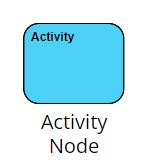
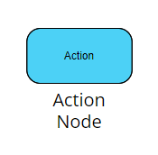
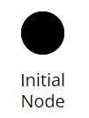
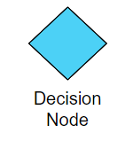
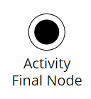

# Lembar Kerja 5

## Deskripsi Soal
Buatlah salah satu diagram UML **"Activity Diagram"** yang terkait dengan case pada praktikum sebelumnya menggunakan Visual Paradigm Community Edition.

**A. Simbol pada Activity Diagram**

Berikut beberapa simbol yang digunakan pada *activity diagram* beserta fungsinya.

| No | Simbol | Gambar | Fungsi |
| --- | --- | --- | --- |
| 1 | *Activity node* |  | Merepresentasikan sequence atau peran  yang terlibat dalam pada sebuah aktivitas atau dapat dikatakan juga sebagai aktor-aktor pada diagram aktivitas
| 2 | *Action node* |  | Merepresentasikan interaksi atau aktivitas yang dilakukan | 
| 3 | *Initial node* |  | Merepresentasikan awal interaksi yang terjadi pada sebuah aktivitas 
| 4 | *Decision Node* |  | Merepresentasikan adanya pemilihan aksi selanjutnya yang ditentukan dengan syarat tertentu |
| 5 | *Activity Final Node* |  | Merepresentasikan akhir dari sebuah contoh aktivitas|

**B. Format Jawaban**

Untuk menjawab jawaban dari LKP 5 ini, mohon dicantumkan ***Screenshot*** beserta dengan penjelasan alur dari *activity diagram* yang kalian buat. Selain itu berikan juga alasan mengapa menggunakan **decision node** dan **activity node** nya pada setiap hubungannya.

 

---

 

# Petunjuk/*Clue*
Disarankan menggunakan [visual paradigm online](https://online.visual-paradigm.com/drive/#infoart:proj=0&dashboard) agar memudahkan kalian tanpa registrasi :D

---
 

    
   
  

    Dibuat dengan 🫶 oleh asisten praktikum ADS
  

