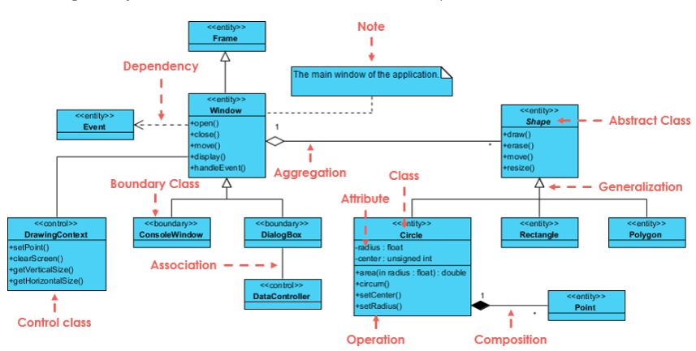
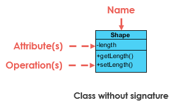

# Lembar Kerja 6

## Deskripsi Soal
Buatlah salah satu diagram UML **"Class Diagram"** yang terkait dengan case pada praktikum sebelumnya menggunakan Visual Paradigm Community Edition.

**A. Simbol pada Class Diagram**

Berikut beberapa simbol yang digunakan pada *activity diagram* beserta fungsinya.

| No | Simbol | Gambar | Fungsi |
| --- | --- | --- | --- |
| 1 | *Class* |  | Merepresentasikan class yang terlibat dalam pada sebuah pada diagram. Class terdiri dari atribut dan operasi. 

**Relation**

    

| No | Simbol | Gambar | Fungsi |
| --- | --- | --- | --- |
| 2 | *Association* |  | Merepresentasikan interaksi antar class yang dilakukan | 
| 3 | *Inheritance or Generalization* |  | Merepresentasikan hubungan taksonomi antara pengklasifikasi yang lebih umum dan pengklasifikasi yang lebih spesifik.
| 4 | *Dependency* |  | Merepresentasikan objek yang bergantung pada objek lain untuk menyelesaikan tugas tertentu, sementara
| 5 | *Agregation* |  | Merepresentasikan hubungan "whole-part" antara objek di mana bagian-bagian dapat berdiri sendiri dan digunakan oleh banyak agregat|

**B. Format Jawaban**

Untuk menjawab jawaban dari LKP 6 ini, mohon dicantumkan ***Screenshot*** beserta dengan penjelasan alur dari *class diagram* yang kalian buat. Selain itu berikan juga alasan mengapa menggunakan **Class** dan **Relation** nya pada setiap hubungannya.

 

---

 

# Petunjuk/*Clue*
Disarankan menggunakan [visual paradigm online](https://online.visual-paradigm.com/drive/#infoart:proj=0&dashboard) agar memudahkan kalian tanpa registrasi :D

Serta untuk mengetahui implementasi dari class diagram dengan berbagai fungsinya lebih lanjut dapat dilihat pada video ini [UML Class Diagram](https://www.youtube.com/watch?v=WnMQ8HlmeXc)

---
 

    
   
  

    Dibuat dengan 🫶 oleh asisten praktikum ADS
  

