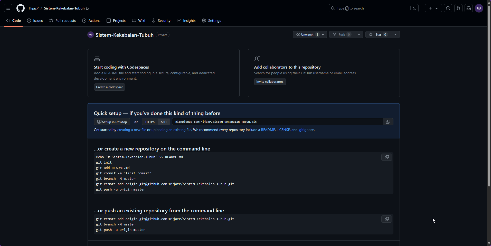
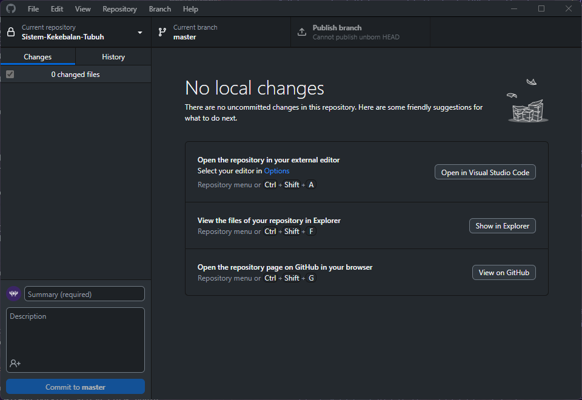

# Memulai Proyek Pengembangan Aplikasi

<div id="tabel-konten">
    Tabel konten
    <ul>
        <li>
            <a href="#git">Git</a>
        </li>
        <li>
            <a href="#github">GitHub</a>
            <ul>
                <li>
                    <a href="#github-repository">GitHub Repository</a>
                </li>
                <li>
                    <a href="#github-project">GitHub Project</a>
                </li>
                <li>
                    <a href="#github-organization">GitHub Organization</a>
                </li>
            </ul>
        </li>
        <li>
            <a href="#dokumen-proyek">Dokumen Proyek</a>
        </li>
    </ul>
</div>

<div id="git">
    <h2>
        <a href="#tabel-konten">Git</a>
    </h2>
</div>

Git adalah distribusi *version control system* yang digunakan untuk berbagai jenis fail. Proyek aplikasi yang dikelola dengan Git akan lebih efektif dan efisien. Contoh kasusnya adalah apabila ingin kembali ke versi di mana aplikasi memiliki minim *bug* ataupun untuk melacak siapa yang membuat versi tersebut.

### Memasang Git
Untuk memasang Git, pergi ke [web Git](https://git-scm.com/downloads) dan unduh sesuai sistem operasi yang digunakan. Kemudian, pasang seperti biasa.
Untuk sistem operasi Windows, tambahkan PATH dari Git agar bisa digunakan di CLI (*command line interface*) lain selain Bash (*CLI bawaan ketika memasang Git*).
Jika ingin menggunakan Git melalui GUI (*graphical user interface*), bisa cek [di sini](https://git-scm.com/downloads/guis) dan pilih sesuai sistem operasi serta aplikasi yang kalian mau. Jika menggunakan sistem operasi Windows atau macOS, bisa menggunakan [GitHub Desktop](#github-desktop) yang nanti akan dibahas.

### Memulai Proyek dengan Git
Sebelum memulai proyek dengan Git, alangkah baiknya mengetahui terlebih dahulu perintah-perintah yang biasa digunakan di Git
| Perintah | Keterangan |
| --- | --- |
| git init | Inisialisasi direktori/folder yang sudah ada menjadi repositori Git |
| git clone | Mengambil seluruh repositori dari lokasi yang dihosting melalui URL |
| git status | Melihat fail yang diubah pada repositori saat ini (*working directory*) |
| git add (fail) | Menambahkan fail untuk dilanjutkan ke *commit* selanjutnya (*stage*) |
| git commit -m "(pesan)" | *Commit* konten dari *stage* dan menjadi *commit snapshot* baru |
| git branch | Melihat daftar *branch* |
| git checkout (branch) | Berpindah ke *branch* lain |
| git remote add (alias) (url) | Menambahkan URL Git sebagai alias |
| git push (alias) (branch) | Mengirimkan *branch commit* lokal ke repositori *remote branch* |
| git pull | *Fetch* dan *merge commit* apapun dari *remote branch* yang terlacak |
| *Cheat sheet* | [GitHub Education](https://education.github.com/git-cheat-sheet-education.pdf) |
| Selengkapnya | [Dokumentasi Git](https://git-scm.com/docs) |

Setelah mengetahui beberapa perintah yang biasa dipakai, kini saatnya untuk memulai proyek dengan Git.
1. Buatlah direktori kosong
2. Buka terminal di direktori tersebut, bisa menggunakan Git Bash
3. Ketik `git init` untuk inisialisasi repositori Git
4. Jika sudah ada direktori `.git`, artinya direktori tersebut sudah menjadi repositori Git (jika tidak terlihat, pergi ke `View` -> `Show` -> lalu centang `Hidden items`)


Sampai sini, repositori Git lokal sudah siap untuk digunakan.

Lebih lanjut, perlu diketahui terlebih dahulu *flow* dari Git ini untuk proyek yang ingin dikerjakan. Bisa mengikuti *workflow* berikut ini


Mari coba untuk mengikuti *workflow* tersebut.
1. Buatlah fail `.txt` sederhana untuk dimasukkan ke tahap *stage*
2. Lakukan perintah `git add .` (. artinya semua fail, bisa juga menambahkan fail spesifik) untuk memasukkan fail `.txt` tersebut ke tahap *stage*
3. Lakukan perintah `git commit -m (pesan)` untuk memasukkan fail `.txt` ke dalam repositori Git lokal


Sampai saat ini, fail `.txt` tersebut sudah dipasangkan VCS.

Lebih lanjut, agar proyek ini bisa dikerjakan secara bersama, maka dibutuhkan Git yang berada di *cloud* atau dalam hal ini *remote Git*. Salah satu *remote Git* yang paling terkenal adalah GitHub, GitLab, dan Bitbucket. Di sini kita akan bahas GitHub karena memiliki fitur yang cukup dan mudah untuk proyek ini.

<div id="github">
    <h2>
        <a href="#tabel-konten">GitHub</a>
    </h2>
</div>

GitHub merupakan layanan *cloud* yang berguna untuk menyimpan dan mengelola sebuah proyek yang dinamakan *repository* (repositori Git). GitHub memiliki fitur-fitur untuk meningkatkan produktivitas dalam mengerjakan proyek, seperti GitHub Repository, GitHub Desktop, GitHub Project, dan GitHub Organization. Mari bahas satu persatu.

<div id="github-repository">
    <h3>
        <a href="#tabel-konten">GitHub Repository</a>
    </h3>
</div>

GitHub Repository seperti halnya repositori Git, tapi dia berada di *cloud* atau *remote* sehingga bisa berkolaborasi dengan proyek yang dipasang Git.

### Membuat GitHub Repository
1. Pergi ke GitHub, lalu di kanan atas ada tanda plus, , kemudian pilih `New repository` (atau, bisa kunjungi https://github.com/new)
2. Isi `Repository name` sebagai nama proyeknya, misal: Sistem-Kekebalan-Tubuh (tidak bisa menggunakan spasi)
3. Isi `Description` sesuai dengan gambaran besar proyeknya, ini opsional
4. Pilih antara `Public` atau `Private`. Jika `Private`, maka repositori hanya akan dilihat oleh pemilik repositori dan orang yang diundang untuk melihat repositori
5. Tambahkan fail README. Isi dari fail ini akan muncul ketika repositori dibuka (dan fail ini ada di dalam direktori sekarang). Fail ini bisa dibuat nanti
6. Tambahkan fail `.gitignore`. Fail ini berguna untuk mengecualikan fail atau direktori spesifik. Fail ini bisa dibuat nanti
7. Tambahkan *license*. Lisensi ini berisi aturan bagaimana proyek atau kode yang ada di repositori bisa digunakan
8. Jika sudah selesai, klik `Create repository`

Berikut adalah tampilan ketika repositori kosong berhasil dibuat. Di sana juga terdapat *hint* perintah untuk mengkoneksikan antara repositori GitHub dengan repositori lokal



### Koneksi dengan Repositori Lokal
Ada beberapa cara untuk mengkoneksikan antara repositori GitHub dengan repositori lokal: [Clone](#koneksi-dengan-cara-clone), [git remote](#koneksi-dengan-cara-git-remote), dan [GitHub Desktop](#koneksi-dengan-menggunakan-github-desktop). Untuk menggunakan *clone* dan `git remote`, pertama perlu konfigurasi informasi pengguna terlebih dahulu. Bisa menggunakan perintah berikut

```
git config --global user.name "(Namadepan Namabelakang)"
git config --global user.email "(email_di_github)"
```


#### Koneksi dengan cara Clone
*Cloning* biasanya dilakukan jika proyeknya sudah ada di repositori GitHub. *Cloning* bisa dilakukan menggunakan HTTPS atau SSH. HTTPS lebih mudah digunakan, tetapi terkadang ada masalah belum terautentikasi dan masalah lain. SSH lebih aman, dan akan lebih simpel jika mempunyai kunci SSH (biasanya lebih mudah jika menggunakan sistem operasi Linux). Untuk sekarang, mari coba melalui HTTPS.

1. Buka repositori GitHub yang sudah dibuat, salin URL dan akhiri dengan `.git` (opsional), contohnya https://github.com/HijazP/Sistem-Kekebalan-Tubuh.git
2. Buka direktori apapun, lalu buka terminal dan ketik perintah `git clone https://github.com/HijazP/Sistem-Kekebalan-Tubuh.git`, sehingga direktori Sistem-Kekebalan-Tubuh akan dibuat
3. Masuk ke direktori tersebut, dan ketik perintah `git status` untuk melihat status dari repositori Git sekarang

Sampai saat ini, repositori di GitHub dan di lokal sudah terkoneksi. Sekarang perubahan fail pada direktori tersebut dapat dikirim ke repositori GitHub.

#### Koneksi dengan cara git remote
Jika sebelumnya sudah memiliki proyek yang sedang dikembangkan dan berada di repositori Git di lokal, maka bisa menggunakan perintah `git remote` untuk menghubungkan repositori lokal dan repositori GitHub yang kosong
1. Pergi ke direktori yang ada proyek dengan repositori lokal di dalamnya, lalu buka terminal
2. Ketik perintah `git remote add origin (URL)`
3. Lalu ketik perintah `git branch -M (namabranch)` jika ingin menyesuaikan *branch*. Jika *branch* yang ada di repositori lokal dan GitHub sama maka tidak perlu mengetik perintah ini

Sampai saat ini, repositori di GitHub dan di lokal sudah terkoneksi. Sekarang perubahan fail pada direktori tersebut dapat dikirim ke repositori GitHub.

#### Koneksi dengan menggunakan GitHub Desktop
GitHub Desktop adalah salah satu Git GUI dari GitHub. GitHub Desktop memungkinkan pengguna untuk menggunakan Git dengan lebih interaktif daripada menggunakan CLI. GitHub Desktop hanya tersedia di sistem operasi Windows dan macOS. Untuk mulai menggunakannya, ikuti langkah berikut
1. Unduh [GitHub Desktop](https://desktop.github.com/) kemudian pasang seperti biasa
2. Masuk menggunakan akun GitHub
3. Akan ada tampilan untuk memilih antara *Clone*, buat baru repositori lokal, dan tambahkan repositori lokal yang sudah ada. Kelebihan GitHub Desktop adalah tidak perlu konfigurasi yang rumit ketika terkoneksi dengan *cloud*.
4. Untuk sekarang, *clone* repositori yang sudah dibuat sebelumnya (Sistem-Kekebalan-Tubuh)
5. Pilih direktori tempat penyimpanan repositori sesuai dengan yang diinginkan di bagian *Local path*. Jika berhasil, maka tampilannya akan seperti berikut



Sampai saat ini, repositori di GitHub dan di lokal sudah terkoneksi. Sekarang perubahan fail pada direktori tersebut dapat dikirim ke repositori GitHub.

### Mulai Menggunakan Repositori GitHub
Karena sudah berhasil untuk mengkoneksikan repositori GitHub dengan lokal, artinya sudah siap untuk mengembangkan proyek. Untuk saat ini, akan dicobakan menggunakan CLI.

Mengacu pada *workflow* yang sudah dibahas sebelumnya, maka langkah-langkahnya adalah sebagai berikut.
1. Buat fail `deskripsi.txt` pada direktori Sistem-Kekebalan-Tubuh. Isi teks tersebut adalah "Sistem kekebalan tubuh membuat tubuh kebal"
2. Simpan fail tersebut, lalu ketik perintah `git status` untuk melihat perubahan
3. Ketik perintah `git add .` (. artinya semua fail, bisa juga menambahkan fail spesifik) untuk memasukkan fail `deskripsi.txt` tersebut ke tahap *stage*. Atau bisa juga dengan `git add deskripsi.txt` untuk fail yang spesifik
4. Ketik perintah `git commit -m "Menambahkan deskripsi.txt" untuk menambahkan semua fail yang ada di *stage* ke repositori lokal
5. Ketik perintah `git push origin master (atau main jika menggunakan branch main)` untuk mengirim semua yang ada di repositori lokal ke repositori *remote*, dalam hal ini GitHub


Sampai saat ini, sudah berhasil untuk mengirimkan semua fail yang ada di lokal ke repositori GitHub.


Lalu, bagaimana cara sinkronisasi antara repositori GitHub dengan lokal? Apakah harus *clone* setiap kali ada perubahan? Tentu tidak. Git menyediakan perintah untuk "menarik" semua perubahan yang ada di repositori *remote*. Berikut langkah-langkahnya.
1. Buka terminal di direktori yang terhubung dengan repositori GitHub (untuk contoh ini, Sistem-Kekebalan-Tubuh)
2. Ketik perintah `git fetch` untuk memeriksa perubahan apa saja yang ada di repositori GitHub
3. Jika ingin menyinkronkan, ketik perintah `git pull` sehingga perubahan yang ada di repositori GitHub akan sama dengan repositori lokal


Sejauh ini, tentang repositori secara dasar sudah cukup. Selanjutnya, bisa dipelajari mengenai penanganan konflik, *branch*, dan lain sebagainya.

<div id="github-project">
    <h3>
        <a href="#tabel-konten">GitHub Project</a>
    </h3>
</div>

GitHub Project merupakan salah satu fitur menarik yang ada di GitHub. Jika mengetahui tentang *kanban board*, maka GitHub Project ini mirip seperti itu. Selain untuk *project management*, GitHub Project juga terintegrasi dengan GitHub Repository yang membuatnya sangat efisien, alat produktivitas bisa hanya di satu platform. Untuk membuatnya, ikuti langkah-langkah berikut.
1. Buka GitHub. Klik ikon profil. Lalu pilih `Your projects`
2. Pilih `New project`, dan akan dialihkan ke GitHub Project yang masih kosong
3. Ada 3 jenis tata letak yang bisa ditampilkan, *Table*, *Board*, dan *Roadmap*
4. Untuk tampilan dan lain sebagainya, bisa diatur sendiri. Silahkan dieksplor (akan ada tutorial secara langsung saat praktikum nanti)

Sejauh ini, GitHub Project sudah siap digunakan. Tapi, belum adanya integrasi ke repositori sehingga tidak akan terasa manfaatnya.

### Integrasi GitHub Project dengan GitHub Repository
Salah satu alasan menggunakan GitHub Project adalah kemudahan integrasi dengan GitHub Repository, sehingga akan meningkatkan produktivitas daripada harus membuat di banyak platform. Untuk integrasinya, ikuti langkah berikut.
1. Buka repositori yang sudah dibuat, pergi ke tab `Projects`
2. Pilih `Link a project` lalu pilih GitHub Project yang sudah dibuat
3. GitHub Project berhasil terintegrasi dengan GitHub Repository

Mudah bukan? Sekarang yang harus dipelajari adalah bagian `Issues` dan `Pull requests`. `Issues` ini berisi rencana atau masalah yang ada di proyek repositori tersebut. Ketika membuat *item* baru di GitHub Project, *item* tersebut akan menjadi draf dan tidak banyak yang bisa dilakukan. Berbeda jika diubah menjadi *issue*, maka *item* tersebut bisa digunakan dan "mengarah" kepada repositori. Lihat contoh berikut


Berbeda jika dibuat menjadi *issue*, maka akan banyak fitur yang bisa digunakan. Untuk membuatnya menjadi menu, ada 2 cara.
1. Dibuat draf terlebih dahulu, lalu pilih `Convert to issue`; atau
2. Saat membuat *item*, pilih repositori dengan mengetik tanda pagar (#) lalu diikuti nama repositori, kemudian pilih `Create new issue`. Akan muncul *pop-up* yang diharuskan mengisi judul *item*, kemudian mengisi pilihan lain seperti deskripsi, penerima tugas, label, dan lain sebagainya


Jika dilihat, ketia *issue* dibuat maka akan ada penomoran untuknya, dalam contoh ini adalah #1. Penomoran ini berguna untuk menandai *issue* yang nantinya bisa digunakan untuk *link* referensi ketika melakukan *commit* atau *pull request* (PR). Untuk mempelajari bagaimana penomoran ini dapat berguna, bisa cek [tautan berikut](https://stackoverflow.com/questions/1687262/link-to-the-issue-number-on-github-within-a-commit-message) atau [tautan yang ini](https://gitdailies.com/articles/link-github-commit-to-issue/#:~:text=How%20to%20Link%20Commits%20to,link%20in%20the%20commit%20message.). Untuk PR sendiri, tidak akan dibahas di sini karena mungkin tidak akan terlalu berguna (karena proyek nantinya itu bukan proyek *open source*, jadinya kecil kemungkinan ada orang lain yang ingin berkontribusi di luar kelompok nantinya), silahkan pelajari sendiri.

Sampai di sini, harusnya semua fitur dasar yang berguna nantinya soal GitHub Project sudah selesai. Untuk fitur-fitur lain, bisa dipelajari sendiri dan semoga sudah paham atas apa yang sudah dibahas.

<div id="github-organization">
    <h3>
        <a href="#tabel-konten">GitHub Organization</a>
    </h3>
</div>

Setelah mempelajari GitHub Repository dan GitHub Project, kurang rasanya bila tidak membahas soal GitHub Organization juga. Anggaplah mempunyai tim atau kelompok yang masing-masing mempunyai tugasnya sendiri (sebagai *front end*, *back end*, *AI engineer*, dan lainnya) dan mempunyai sumber kodenya sendiri, apakah semua sumber kodenya disimpan di 1 repositori? Atau harus membuat banyak repositori di 1 akun atau tiap yang bertugas mempunyai repositorinya sendiri? Tentu hal ini sangat tidak efisien. Karena, nantinya perlu mengundang lagi orang-orang yang terlibat dalam proyeknya dan lain sebagainya. Lalu solusinya apa? Tentu dengan GitHub Organization!

Untuk membuat GitHub Organization, ikuti langkah berikut.
1. Buka GitHub. Klik ikon profil. Lalu pilih `Your organizations`
2. Pilih `New organization`, maka akan diarahkan ke halaman *plan* untuk organisasinya. Pilih `Create a free organization` lalu akan diarahkan ke halaman `Set up your organization`
3. Isi data-data seperti nama organisasi, kontak email, dan pilih `My personal account` kemudian `Next`
4. GitHub Organization sudah selesai dibuat

Sampai sini, GitHub Organization bisa dianggap sebagai akun baru, atau bahkan akun barengan. Di dalam organisasi, bisa membuat repositori, kemudian *project*, dan masih banyak lagi. Enaknya, hal tersebut bisa dilakukan oleh banyak orang yang tergabung pada organisasi tersebut. Jadi, jika membuat tim dan mempunyai tugasnya masing-masing, membuat repositori bisa di 1 organisasi saja, tidak perlu di masing-masing akun ~~apalagi membuat banyak branch di 1 repo~~.

<div id="dokumen-proyek">
    <h2>
        <a href="#tabel-konten">Dokumen Proyek</a>
    </h2>
</div>

Setelah mempelajari Git, GitHub, dan fitur-fiturnya untuk manajemen proyek dan meningkatkan produktivitas, tibalah saatnya untuk memulai proyek berdasarkan dokumen proyek

#### Berikut tautan dokumen proyeknya → [Dokumen Proyek](https://docs.google.com/document/d/1sTkWfmXf1V3mXmVMd3p717phh7ilb3spdGprtPbjfyY/edit) ←

---
<br>
<div align="center">
    
  <br />
  <p>
    Dibuat dengan 🫶 oleh asisten praktikum ADS
  </p>
</div>
