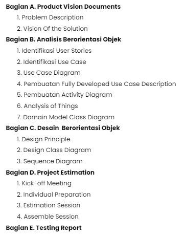
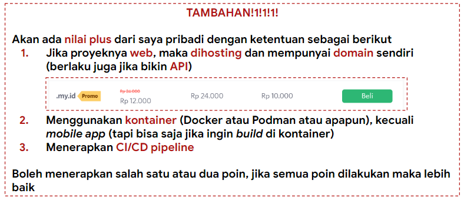

# Projek Akhir ADS

    Tabel konten
    <ul>
        <li>
            <a href="#Umum">Ketentuan Umum</a>
        </li>
        <li>
            <a href="#LKP">Pembagian LKP</a>
        </li>
        </li>
        <li>
            <a href="#Dokumentasi">Dokumen Proyek</a>
        </li>
           <li>
            <a href="#Tambahan">Ketentuan Tambahan</a>
        </li>
    </ul>

    <h2>
        <a href="#tabel-konten">Ketentuan Umum</a>
    </h2>

Projek akhir mata kuliah Analisis Desain Sistem (ADS) dikerjakan oleh sekelompok mahasiswa berjumlah 3-4 orang dengan tema bebas asalkan menerapkan prinsip Object Oriented Programming (OOP) dalam pengembangannya. Presentasi tugas akhir akan dilakukan pada pertemuan ke-14 dihadapan dosen mata kuliah sebagai penguji.

### Komponen projek
Projek ini terdiri dari 6 komponen sebagai berikut:
1. Use case -> minimal 5
2. Class diagram -> minimal 5
3. Design pattern -> minimal 1
4. Management system -> GitHub
5. Implementasi OOP
6. Ketentuan lain yang jadi nilai tambah

### Deadline
Semua komponen projek wajib dikumpulkan pada H-3 sebelum pertemuan 14 yaitu pada tanggal 20 Mei 2024 Pukul 23.59. 

    <h2>
        <a href="#LKP">Pembagian LKP</a>
    </h2>

LKP mingguan berupa laporan projek yang dibagi per minggu dengan pembagian sebagai berikut:

1. LKP 8 : Bagian A - Bagian B No. 4
2. LKP 9 : Bagian B No. 5 - Bagian C
3. LKP 10: Bagian D - Bagian E

Deadline LKP : Setiap minggu seperti biasa

Berikut tautan dokumen proyeknya → [Dokumen Proyek](https://docs.google.com/document/d/1sTkWfmXf1V3mXmVMd3p717phh7ilb3spdGprtPbjfyY/edit) ←

    <h2>
        <a href="#tabel-konten">Dokumen projek</a>
    </h2>

Dokumen ataupun link penting dari projek silahkan ini di link berikut 

[Link projek](https://docs.google.com/spreadsheets/d/1pWkqq2awsSwaFEr54R4sBukwcT47Q7KwjWdfIyNpYA4/edit#gid=0)

    <h2>
        <a href="#tabel-konten">Ketentuan tambahan</a>
    </h2>

---
 

    
   
  

    Dibuat dengan 🫶 oleh asisten praktikum ADS
  

